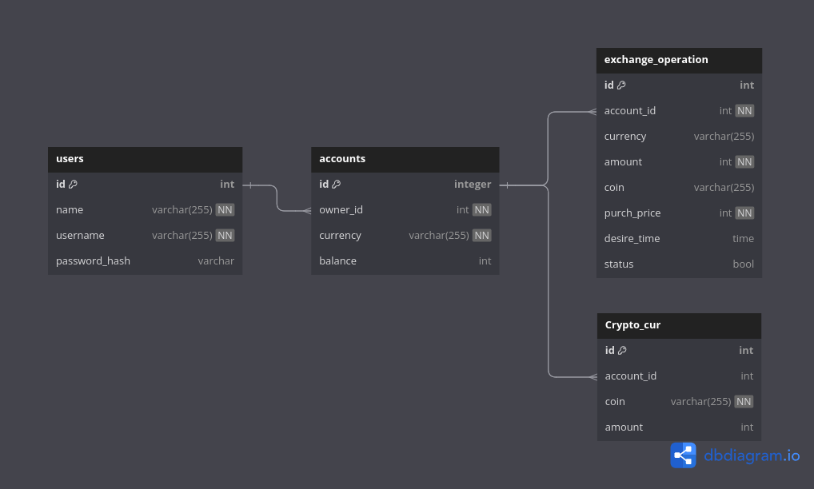

## REST API для отслеживания и покупки валюты

Задание находиться [здесь](./docs/task.md)

#### Использованные технологии:
* Разработка, следуя дизайну REST API.
* Gin Web Framework для роутинга.
* Создание файлов миграций для поднятия БД с помощью утилиты go-migrate.
* Регистрация и аутентификация.
* Работа с JWT. Middleware для определения пользователя .
* Конфигурация приложения с помощью библиотеки cleanenv.
* Логирование ошибок с помощью библиотеки logrus.
* Graceful Shutdown для безопасной остановки приложения.

Для отслеживания курса валюты можно подключиться по websocket'у к API alphavantage и сравнивать цену монеты с желаемой ценой пользователя.
Когда курс будет удовлетворять требованиям, со счёта пользователя списываются средсва и определённое кол-во монет зачисляется на его счёт.
Если ползователь решил отменить операцию до её совершения, то со счёта ничего не спишется и обработчик прекратит слушать этот курс.

### Список эндпоинтов:
##### Регистрация и аутентификация:
```
-X POST http://{host}:{port}/auth/sign-up — регистрация
```
```
-X POST http://{host}:{port}/auth/sign-in — аутентификация
```
##### Операции над счетами:
```
-X POST http://{host}:{port}/api/accounts/ — Создать счёт
```
```
-X GET http://{host}:{port}/api/accounts/ — Получить все счета пользователя
```
```
-X GET http://{host}:{port}/api/accounts/{id} — Получить счёт по id
```
```
-X PUT http://{host}:{port}/api/accounts/deposit/{id} — Пополнить счёт по id
```

---

<table>
    <thead>
        <tr>
            <th>Операция над</th>
            <th>Тело запроса</th>
        </tr>
    </thead>
    <tbody>
        <tr>
            <td rowspan=1 align="center">Пользователями</td>
            <td rowspan=1 align="left">{</br>
                                            "name" : " ", </br>
                                            "username" : " ", 
                                            </br>
                                            "password" : " "</br>
                                        }</td>
        </tr>
        <tr>
            <td align="center">Счетами</td>
            <td align="left">{</br>
                                "currency": " ",</br>
                                "balance":  </br>
                            }</td>
        </tr>
    </tbody>
</table>

---

### Схема Базы данных


---
Для запуска приложения перейдите в дириекторию проекта в терминале и запустите следующие команды:
```
make app-build && make app-run
```

Если запуск производится впервые, то необходимо применить миграции к БД:
```
make migrations_up
```